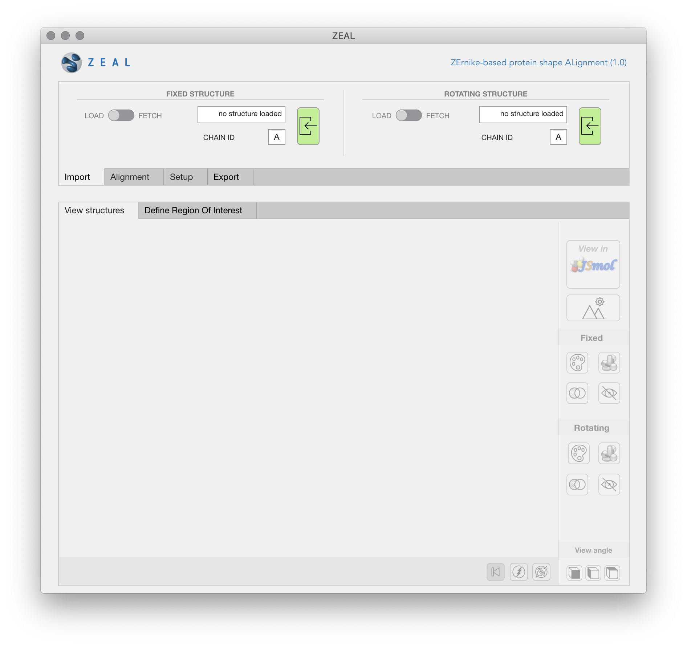
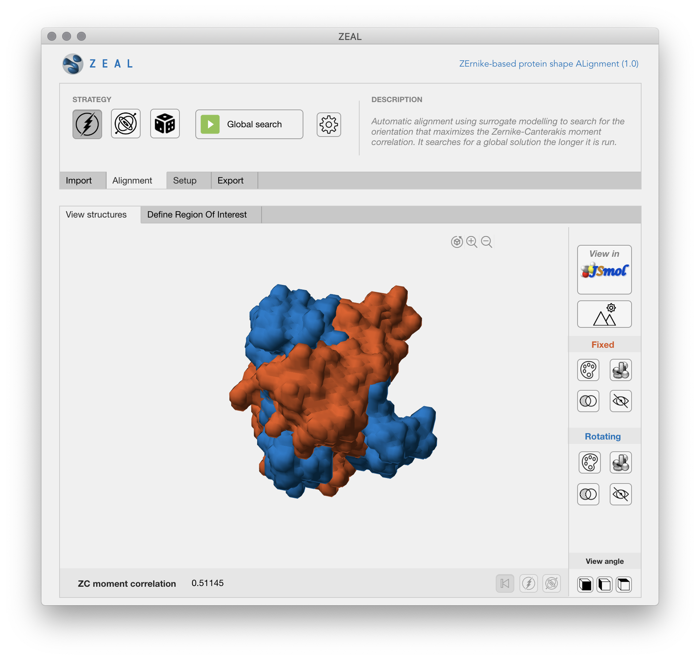
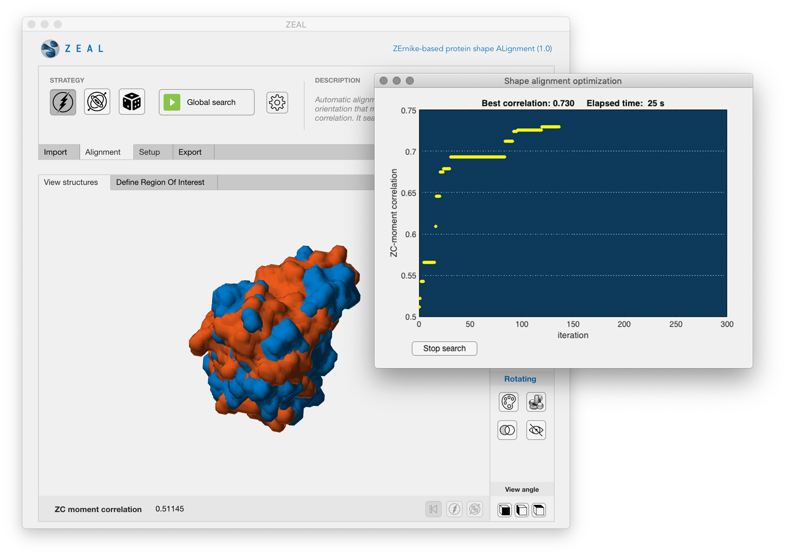

#  <span style="color:white">.<\span>


> ### What?
> ZEAL is an app that allows two molecules to be rotationally aligned based on their shape resemblance.

> ### Why?
> Proteins with similar global shape are often functionally related, despite low sequence and backbone conformation similarity. Conventional structure alignment tools will often fail to generate relevant alignments in such cases. 

> ### How?
> By projecting the protein shape onto 3D Zernike-Canterakis (ZC) functions, it is possible to extract varying levels of shape details in the moments associated with a set of ZC functions. ZEAL will find the optimal shape alignment by searching for the rotation that maximizes the correlation between moments from two structures.


## Installation

1. Download the ZEAL installer from [github.com/Andre-lab/ZEAL](https://github.com/Andre-lab/ZEAL/tree/master/installation)
	or at [Filip´s Dropbox](https://www.dropbox.com/s/9fvfkwd16kq8dw5/ZEAL_webInstaller_mcr.zip?dl=0). The installer will download the [MATLAB-runtime](https://se.mathworks.com/products/compiler/matlab-runtime.html) enviroment necessary for ZEAL to run. 

2. To install the standalone application, double-click the `ZEAL_webInstaller_mcr.app` executable.
	
3. To complete installation, follow the instructions on the user interface.

	??? note "Proxy server"
		If you want to connect to the Internet using a proxy server, click Connection Settings. Enter the proxy server settings in the provided window. Click OK.
	

	!!! Note
		On Linux and Mac OS X, you do not have the option of adding a desktop shortcut.


### MatlabApp
If you have MATLAB installed, you can install ZEAL as a [Matlab app](https://se.mathworks.com/discovery/matlab-apps.html) directly. 

1. Download the `ZEAL_install_bundle.zip` at [github.com/Andre-lab/ZEAL/](https://github.com/Andre-lab/ZEAL/tree/master/installation) or from [Filip´s Dropbox](https://www.dropbox.com/s/ueysv2zt6us3pxi/ZEAL_install_bundle.zip?dl=0). This file contains the *mlapp*-installer and folders necessary for ZEAL to run.

2. Extract the ZIP file to a destination where ZEAL should be run from within MATLAB.

3. In Matlab, navigate to the folder in step (2). 

4. Double-click the `ZEAL_1.mlappinstall` executable and ZEAL will be installed as an app within MATLAB.

5. Start ZEAL via *The Apps tab* of the MATLAB Toolstrip, which shows you the apps that you currently have installed.

## Launching the app
To run your standalone application:

1. Open a terminal window.

	??? summary "Windows"
				1. Click the "Start" button to open the Start menu.
				2. Open the "All Programs" menu, followed by the "Accessories" option.
				3. Select the "Command Prompt" option from the "Accessories" menu.

	??? summary "Mac OS X"		
				1. Open a Finder window.
				2. Select Applications from the left side.
				3. Click the arrow to expand the Utilities folder.
				4. Double-click Terminal.

2. Navigate to the folder into which you installed the application. If you accepted the default settings, you can find the folder in one of the following locations by executing the command in the terminal:

	|  Platform                       | Path                         | 
	| ----------------------------- |:------------------------------:| 
	| Windows                       | `cd C:\Program Files\ZEAL`         | 
	| Mac OS X                      | `cd /Applications/ZEAL`             | 
	| Linux                         | `cd /usr/ZEAL`                      | 

3. Run the application using one of the following commands:

	|  Platform | Path                           | 
	| ----------|:------------------------------:| 
	| Windows   | ```application\ZEAL  ```        | 
	| Mac OS X  | ``` ./application/run_ZEAL.sh /Applications/MATLAB/MATLAB_Runtime/v97 ``` |
	| Linux     | ``` ./ZEAL ```                     | 

	??? note "Mac OS X"
				The shell script `run_ZEAL.sh` will temporarily set the necessary environment variables and start 
			 	the application)

			   	to run the shell script, type
			   
			       		./run_ZEAL.sh <mcr_directory> <argument_list>
			       
			    at Linux or Mac command prompt. `<mcr_directory>` is the directory 
			    where version 9.7 of the MATLAB Runtime is installed or the directory where 
			    MATLAB is installed on the machine. 

			    For example, if you have version 9.7 of the MATLAB Runtime installed in 
			    /mathworks/home/application/v97, run the shell script as:
			    
			       ./run_ZEAL.sh /mathworks/home/application/v97
			       
			    If you have MATLAB installed in /mathworks/devel/application/matlab, 
			    run the shell script as:
		    
		       ./run_ZEAL.sh /mathworks/devel/application/matlab

## Getting started
Once ZEAL is running, performing a shape alignment is easy and the app design should make most operations feel intuitive. 

1. Import the two structures you want to align by clicking the green load buttons in the import-tab. The "fixed" structure is the reference structure and 	the "rotating" structure is the structure whose orientation is going to be changed after the alignment. ZEAL allows structures to be loaded from pdb files, or to be downloaded directly from the PDB server - use the load-fetch switch to change between the modes.  

2. After importing the two structures you will see a low-resolution representation of the solvent-accessible surface of the structures - this can be changed in the setup tab. Note that the structures might have different relative sizes due to scaling (this is to achieve [scale invariance](howItWorks.md) when comparing the shapes).  

3. Click the *Play button* (*Global search*) to start the search for optimal shape alignment. The progress of the search will be shown in a new window; the alignment with the best correlation coefficient found after a certain number of function evaluations. The search can be stopped by clicking on the stop button, otherwise it will stop when the [stopping criteria](userGuide.md) is met. 
 

4. To inspect the alignment in more detail you can view the structures in JSmol if you like. Click the export tab if you want to save the aligned structures to a pdb file. 
 
